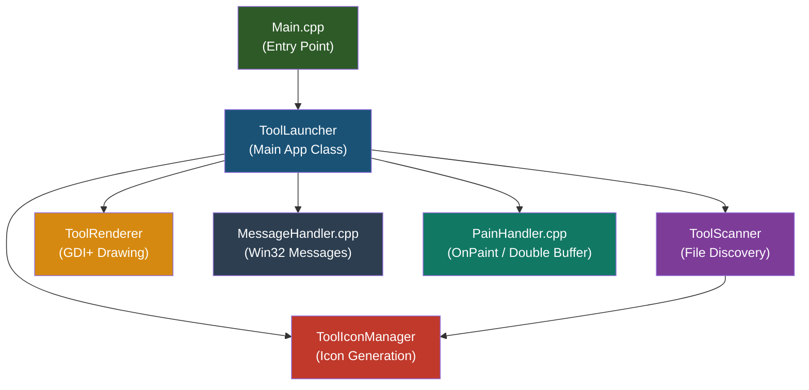
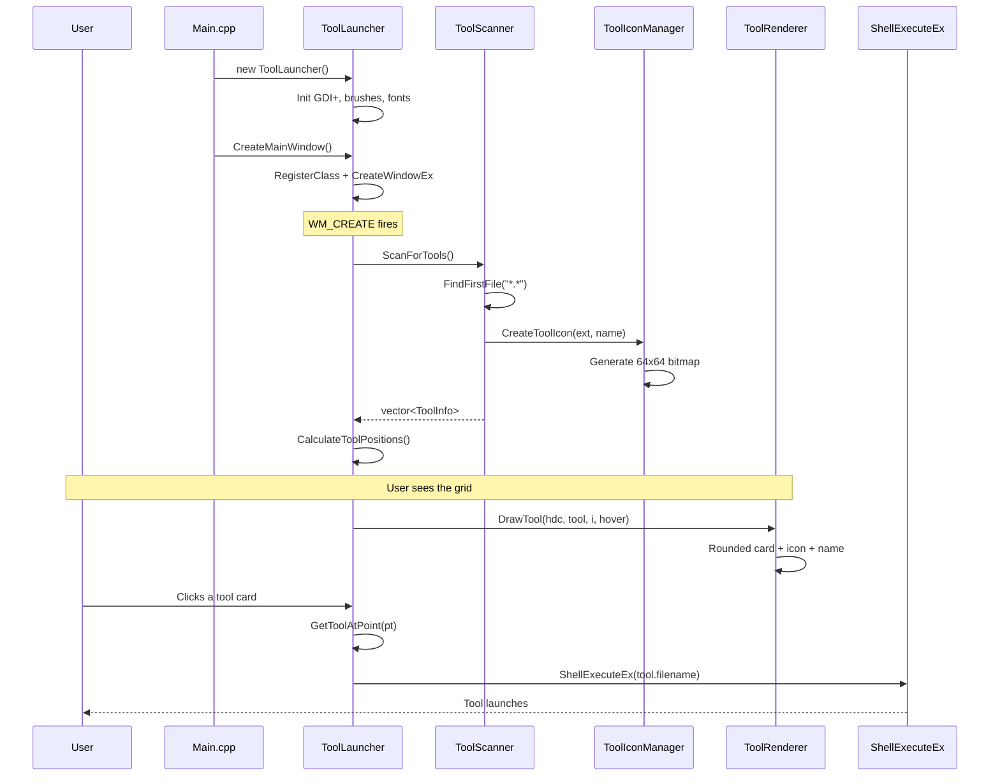

# Customization Tools — Full Codebase Walkthrough

## What Is This Project?

This is a **Windows desktop application** built with the **Win32 API and GDI+** (Visual Studio C++ project). It acts as a **tool launcher** — a graphical dashboard that automatically discovers scripts and executables (`.bat`, `.py`, `.exe`, `.ps1`) in the same directory and displays them as clickable cards in a Windows 11-styled grid UI. Clicking a card launches the corresponding tool.

The project also contains several standalone **utility scripts** (the "tools" themselves) for file operations, code metrics, and content replacement.

---

## Architecture Overview

---

## Core C++ Files (The Launcher App)

### 1. [Main.cpp](file:///e:/Customization-project/Main.cpp) — Entry Point

The standard Win32 `wWinMain` function. It does three things:

1. **Initializes COM** (`CoInitializeEx`) — required for `ShellExecuteEx` to launch external tools.
2. **Creates a `ToolLauncher`** object, calls `CreateMainWindow()` to register the window class and create the HWND.
3. **Runs the message loop** (`GetMessage` / `TranslateMessage` / `DispatchMessage`), keeping the app alive until closed.

---

### 2. [Main.h](file:///e:/Customization-project/Main.h) — Central Header

Defines all shared constants, types, and the main class:

| Item | Purpose |
|---|---|
| **Layout constants** | `HEADER_HEIGHT=80`, `TOOL_BUTTON_SIZE=150`, `COLS_PER_ROW=8` |
| **Win11 color palette** | `win11_background`, `win11_surface`, `win11_hover`, `win11_accent`, `win11_text` |
| **`ViewMode` enum** | `List`, `VIEW_GRID`, `Details` (only Grid is actively used) |
| **`ToolInfo` struct** | Holds each tool's `filename`, `displayName`, `extension`, bounding `rect`, and `icon` HBITMAP |
| **`ToolLauncher` class** | The main application class — owns the window, search box, status bar, tool data, scroll state, double-buffer, and all drawing/interaction logic |

---

### 3. [ToolLaunchers.cpp](file:///e:/Customization-project/ToolLaunchers.cpp) — Core Application Logic

Contains the `ToolLauncher` constructor, destructor, and primary methods:

- **Constructor**: Initializes GDI+, creates GDI brushes (background, button, hover, accent), fonts (Segoe UI Variable), and instantiates `ToolIconManager`, `ToolScanner`, and `ToolRenderer`.
- **Destructor**: Shuts down GDI+, deletes all GDI objects and tool icon bitmaps, cleans up the double buffer.
- **`CreateMainWindow()`**: Registers a `WNDCLASS` with the static `WndProc`, creates an overlapped window (900×700) with scroll bars and rounded corners (DWM).
- **`MessageLoop()`**: Standard Win32 message pump.
- **`ScanForTools()`**: Delegates to `ToolScanner`, stores results, resets scroll, recalculates layout.
- **`CalculateToolPositions()`**: For grid mode, arranges tools in an 8-column grid with 150px cards. For list mode, stacks vertically. Adjusts positions by scroll offset.
- **`FilterTools(searchText)`**: Case-insensitive substring match on display names; replaces underscores with spaces before matching.
- **`LaunchTool(index)`**: Uses `ShellExecuteEx` with `lpVerb = "open"` to launch the selected tool.
- **`GetToolAtPoint(pt)`**: Hit-tests the mouse position against all tool bounding rectangles.

---

### 4. [MessageHandler.cpp](file:///e:/Customization-project/MessageHandler.cpp) — Win32 Message Processing (~970 lines)

The heart of the UI interaction logic, handling 14 categories of Windows messages:

| Message | What It Does |
|---|---|
| **`WM_CREATE`** | Creates the search panel (rounded static control), edit box, clear button (×), and status bar. Sets fonts, placeholder text, and calls `ScanForTools()`. |
| **`WM_DRAWITEM`** | Custom-draws the search panel with a rounded border and magnifying glass icon. |
| **`WM_PAINT`** | Fills background and delegates to `OnPaint()`. |
| **`WM_SIZE`** | Repositions search components using `DeferWindowPos` (batched). Recalculates virtual size, scroll bars, and tool positions. |
| **`WM_MOUSEMOVE`** | Tracks hover state. Only invalidates the *specific* tool regions that changed (previous and new hover) to prevent flickering. Updates cursor (hand vs arrow) and status bar text. |
| **`WM_MOUSELEAVE`** | Resets hover state when mouse exits the window. |
| **`WM_LBUTTONDOWN/UP`** | Handles tool clicks (launch tool) and clear button clicks (reset search). Uses a "press + release on same target" pattern for reliable click detection. |
| **`WM_COMMAND`** | Handles `EN_CHANGE` from the search box (live filtering) and the clear button command. |
| **`WM_CTLCOLOREDIT`** | Sets custom text color for the search box. |
| **`WM_KEYDOWN`** | Keyboard shortcuts: **F5** = refresh, **Esc** = clear search, **Enter** = quick-launch first result, **Ctrl+F** = focus search, **Page Up/Down**, **Ctrl+arrows**, **Ctrl+Home/End** for scrolling. |
| **`WM_TIMER`** | Clears "Launched: …" status message after 3 seconds. |
| **`WM_ERASEBKGND`** | Returns 1 (suppresses erase) to prevent flickering. |
| **`WM_HSCROLL/VSCROLL/MOUSEWHEEL`** | Full scroll bar support with line, page, thumb tracking, and Shift+wheel for horizontal scroll. |
| **`WM_DESTROY`** | Cleans up fonts and posts quit message. |

Also contains the **static `WndProc`** that stores/retrieves the `ToolLauncher*` pointer via `GWLP_USERDATA`, and helper functions: `UpdateStatusText`, `DrawSearchIcon`, `ConvertTopropercase`, `CalculateVirtualSize`, `UpdateScrollBars`, scroll handlers, and `InvalidateToolRegion`.

---

### 5. [PainHandler.cpp](file:///e:/Customization-project/PainHandler.cpp) — Painting & Double Buffering

> [!NOTE]
> The filename is "PainHandler" (likely a typo of "PaintHandler").

- **`OnPaint(HDC hdc)`**: The main rendering function:
  1. Checks if the double buffer needs resizing.
  2. Fills the background.
  3. Draws a **gradient header** (using GDI+ `LinearGradientBrush` — pink-to-white).
  4. Draws the "Customization Tools" subtitle in blue.
  5. Iterates all `filteredTools` and calls `renderer->DrawTool()` for each.
  6. **BitBlt**s the offscreen buffer to the screen for flicker-free display.

- **`UpdateDoubleBuffer(w, h)`**: Creates a compatible DC and bitmap for offscreen drawing.
- **`CleanupDoubleBuffer()`**: Frees the buffer resources.

---

### 6. [ToolScanner.cpp](file:///e:/Customization-project/ToolScanner.cpp) / [ToolScanner.h](file:///e:/Customization-project/ToolScanner.h) — File Discovery

Scans the **current working directory** for tool files:

- Uses `FindFirstFile` / `FindNextFile` with `*.*` pattern.
- Filters by an `unordered_set` of supported extensions: `.bat`, `.py`, `.exe`, `.ps1`.
- Skips directories.
- For each match, creates a `ToolInfo` with the display name (filename minus extension) and an icon (via `ToolIconManager`).
- Also provides a `FilterTools()` method (case-insensitive substring search) and a `ToLower()` utility.

---

### 7. [ToolRenderer.cpp](file:///e:/Customization-project/ToolRenderer.cpp) / [ToolRenderer.h](file:///e:/Customization-project/ToolRenderer.h) — GDI+ Card Rendering

Draws individual tool cards:

- **`DrawTool()`**: Renders a tool as a rounded-rectangle card with:
  - A subtle **drop shadow** (20% opacity black).
  - A **filled card** (white normally, light gray on hover).
  - A colored **border** (blue on hover, light gray normally).
  - The tool's icon and name.

- **`DrawToolIcon()`**: Blits the 64×64 icon HBITMAP into the card. If no icon exists, draws a red "NO ICON" placeholder.

- **`DrawToolName()`**: Renders the tool name below the icon in Segoe UI 20pt bold, purple-ish text (`RGB(102, 102, 153)`), with word-wrapping and ellipsis for long names.

- **`FillRoundedRectangle()` / `DrawRoundedRectangle()`**: GDI+ helper functions using `GraphicsPath` with arcs to create rounded corners.

- **`DrawHeader()`**: Draws the header section (this function exists but the actual header drawing is done inline in `PainHandler.cpp::OnPaint`).

---

### 8. [ToolIconManager.cpp](file:///e:/Customization-project/ToolIconManager.cpp) / [ToolIconManager.h](file:///e:/Customization-project/ToolIconManager.h) — Dynamic Icon Generation

Generates 64×64 bitmap icons programmatically (no external icon files needed):

- **`CreateToolIcon()`**: Creates a compatible bitmap, fills it with the Win11 background color, then draws a symbol on top.
- **`GetIconBrush()`**: Returns extension-specific colors:
  - `.py` → Blue (`52, 144, 220`)
  - `.bat` → Gray (`72, 72, 72`)
  - `.exe` → Blue (`0, 120, 215`)
  - `.ps1` → Dark blue (`1, 36, 86`)
- **`GetIconSymbol()`**: Returns an emoji/text for each extension:
  - `.py` → 👽 (alien)
  - `.bat` → ⚡ (lightning)
  - Others → Uppercase extension text (e.g., "EXE", "PS1")
- **`DrawIconText()`**: Renders the symbol centered in the bitmap using the "Segoe UI Emoji" font in green text.

---

### 9. [copy.cpp](file:///e:/Customization-project/copy.cpp) — Standalone File Copy Utility

A **separate console application** (not part of the launcher) that uses COM `IFileOpenDialog` to:

1. Let the user pick multiple files/folders (with a multi-select dialog).
2. Let the user pick a destination folder.
3. Copy everything to the destination using `std::filesystem::copy`.

---

## Utility Scripts (The "Tools" That Get Launched)

### [Content_Replacement_Tool.py](file:///e:/Customization-project/Content_Replacement_Tool.py)
- **Purpose**: Bulk find-and-replace in source files using rules from an Excel spreadsheet.
- **Flow**: Opens a file dialog to pick an Excel file (with `old_content` / `new_content` columns), then picks target files, and applies all replacements. If `new_content` is empty, the matching line is deleted entirely.

### [CodeLine Counter.py](file:///e:/Customization-project/CodeLine%20Counter.py)
- **Purpose**: Counts lines of code (LOC) in `.h` and `.cpp` files within a folder.
- **Excludes**: Blank lines and comment lines (`#`, `//`, `/*`, `*`, `*/`).
- **Output**: Prints a detailed per-file table and calculates KLOC (thousands of lines).

### [file_rename.py](file:///e:/Customization-project/file_rename.py)
- **Purpose**: Batch-renames files using regex patterns defined in an Excel file (`old_name` → `new_name` columns).
- **Logging**: Creates timestamped log files in `C:\Customization tool\rename files\`.
- **Post-action**: Opens the folder and log file after completion.

### [AccessFolders.bat](file:///e:/Customization-project/AccessFolders.bat)
- **Purpose**: Creates and provides quick-access menu to a predefined folder structure under `S:\Review comments\COMMENTS FILES\` with categories like Review-CheckList, Testcase, Excel, CPP, Image, PDF, etc.
- **Interaction**: Displays a numbered menu; user types a number to open the corresponding folder.

### [close.bat](file:///e:/Customization-project/close.bat)
- **Purpose**: Force-kills all running processes using `taskkill /F /T /FI "STATUS eq RUNNING"`. A "nuclear option" to close everything.

### [copy_usermade.bat](file:///e:/Customization-project/copy_usermade.bat)
- **Purpose**: Creates timestamped backup copies of a user-specified folder into `C:\Customization tool\backup folder\`. Uses `xcopy` for recursive copying and opens the backup folder when done.

---

## Data Flow Summary

---

## Key Design Decisions

| Decision | Rationale |
|---|---|
| **Double buffering** | All drawing goes to an offscreen bitmap first, then `BitBlt` to screen — eliminates flicker |
| **Region-specific invalidation** | On hover, only the old and new tool rectangles are invalidated, not the entire window |
| **`WM_ERASEBKGND` returns 1** | Prevents Windows from erasing the background before `WM_PAINT`, avoiding flash |
| **`DeferWindowPos`** | Batches search bar repositioning during resize for performance |
| **GDI+ for cards, GDI for text** | Cards use anti-aliased rounded rectangles (GDI+), text uses ClearType (GDI) |
| **Dynamic icon generation** | No external icon files needed — icons are generated at runtime from emoji/text |
| **COM for tool launching** | `ShellExecuteEx` handles `.py`, `.bat`, `.exe`, `.ps1` via system associations |
| **Current-directory scanning** | Tools are discovered from wherever the `.exe` is running — portable design |
